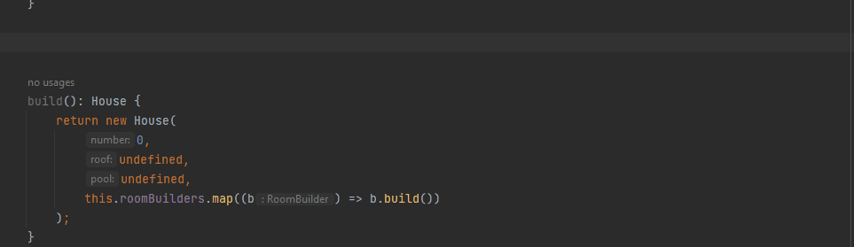

# Typescript Fluent Builder Live Templates

Live templates for TypeScript to create fluent builders and provide supporting templates.

## Templates

This plugin provides the following templates:
- `builder` - Creates a new builder with context of the current file.
- `withField` - Adds a 'with' function for a field to the current builder.
- `withBuild` - Adds a 'with' function for a sub-builder to the current builder.
- `withNull` - Adds a 'with' function for a nullable sub-builder to the current builder.
- `withArr` - Adda a 'with' function to append to a list of sub-builders.

### `builder`

Is a basic builder template which can expanded.

Template:
```
export class $builderName$ {
    constructor(builderFunction: (builder: $builderName$) => void = (e) => e) {
        builderFunction(this);
    }

    build(): $entity$ {
        return {} as $entity$;
    }
}
```
Example usage: 


###  `withField`

Template:
```
private $fieldName$: $type$ = $defaultValue$;

with$capitalizedFieldName$($fieldName$: $type$): this {
    this.$fieldName$ = $fieldName$;
    return this;
}
```

Example usage:


###  `withBuild`

Template:
```
private $entityName$Builder: $builderName$Builder = new $builderName$Builder();

with$capitalizedEntityName$(
    builderFunction: (builder: $builderName$Builder) => void = (e) => e
): this {
    builderFunction(this.$entityName$Builder);
    return this;
}
```

Example usage:


###  `withNull`

Template:
```
private $entityName$Builder: $builderName$Builder;

with$capitalizedEntityName$(
    builderFunction: (builder: $builderName$Builder) => void = (e) => e
): this {
    const newBuilder = new $builderName$Builder();
    builderFunction(newBuilder);
    this.$entityName$Builder = newBuilder;
    return this;
}
```

Example usage:



###  `withArr`

Template:
```
private $entityName$Builders: $builderName$Builder[] = [];

with$capitalizedEntityName$(builderFunction: (builder: $builderName$Builder) => void = e => e): this {
    const newBuilder = new $builderName$Builder();
    builderFunction(newBuilder);
    this.$entityName$Builders.push(newBuilder);
    return this;
 }
```

Example usage:


