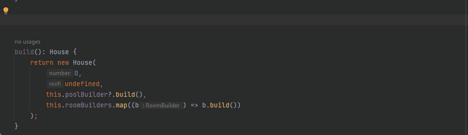
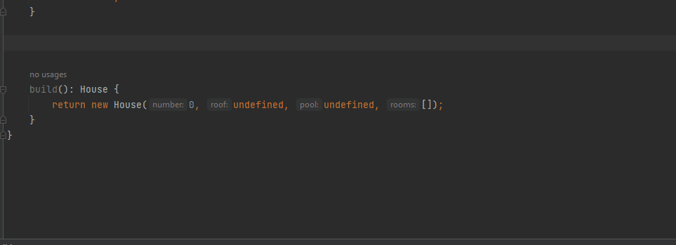

# Typescript Fluent Builder Live Templates

Live templates for TypeScript to create fluent builders and provide supporting templates.

## Templates

This plugin provides the following templates:
- `builder` - Creates a new builder with context of the current file.
- `withField` - Adds a 'with' function for a field to the current builder.
- `withBuild` - Adds a 'with' function for a sub-builder to the current builder.
- `withNull` - Adds a 'with' function for a nullable sub-builder to the current builder.
- `withArr` - Adda a 'with' function to append to a list of sub-builders.

### `builder`

Is a basic builder template which can expanded.

Template:
```
export class $builderName$ {
    constructor(builderFunction: (builder: $builderName$) => void = (e) => e) {
        builderFunction(this);
    }

    build(): $entity$ {
        return {} as $entity$;
    }
}
```
Example usage: 


###  `withField`

Template:
```
    with$fieldName$($fieldNameLower$: $type$): $currentBuilderName$ {
        this.$fieldNameLower$ = $fieldNameLower$;
        return this;
    }
```

Example usage:


###  `withBuild`

Template:
```
 with$entityName$(
        builderFunction: (builder: $entityName$Builder) => void = (e) => e
    ): $currentBuilder$ {
        builderFunction(this.$entityNameDecaps$Builder);
        return this;
    }
```

Example usage:



###  `withNull`

Template:
```
    with$entityName$(
        builderFunction: (builder: $entityName$Builder) => void = (e) => e
    ): $currentBuilder$ {
        const newBuilder = new $entityName$Builder();
        builderFunction(newBuilder);
        this.$entityNameDecaps$Builder = newBuilder;
        return this;
    }
```

Example usage:


###  `withArr`

Template:
```
    with$entityName$(builderFunction: (builder: $entityName$Builder) => void = e => e): $currentBuilderName$ {
        const newBuilder = new $entityName$Builder();
        builderFunction(newBuilder);
        this.$builderArray$Builders.push(newBuilder);
        return this;
     }
```

Example usage:



